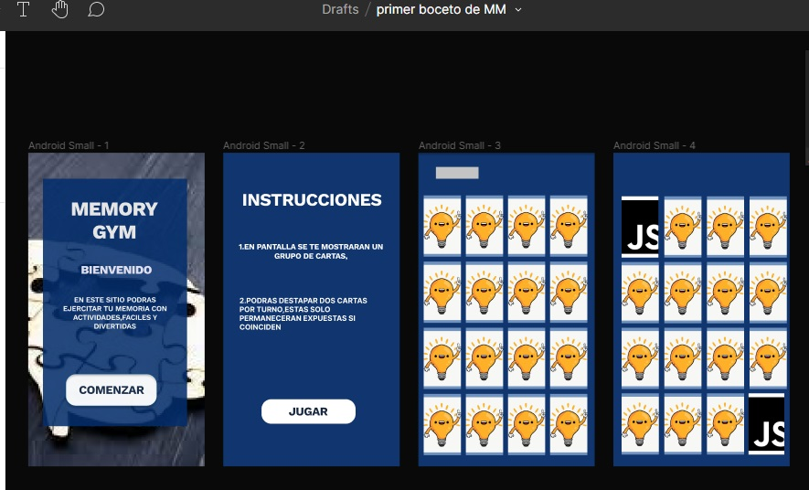

# Memory Match Game

## Índice

* [1. Preámbulo](#1-preámbulo)
* [2. Resumen del proyecto](#2-resumen-del-proyecto)
* [3. Historias de usuario](#3-historias-de-usuario)
* [4. Diseño de interfaz de usuario](#4-diseño-de-interfaz-de-usuario)
* [5. Archivos](#5-archivos)

***

## 1. Preámbulo

El juego [_Memory Match_](https://en.wikipedia.org/wiki/Concentration_(card_game)),
también conocido como _Concentration_, _Match Match_, _Match Up_, _Memory_,
entre otros, es un juego de cartas en el que todas las cartas se ponen cara
abajo sobre una superficie y se le dan la vuelta a dos cartas en cada turno. El
objetivo del juego es destapar parejas de cartas que coincidan.

## 2. Resumen del proyecto

En este proyecto se construyo un juego de memorama con tematica de diseño web, que 
permite visualizar el contenido de las cartas  durante 10 segundos y luego 
mantiene visibles las que son pares y oculta las que no,ademas de que cuando todas los pares sean 
descubiertos mmuestra al usuario un aviso de felicitacion por haber concluido el juego.

Este proyecto se llevo a cabo de forma individual por lo que la interaccion de versiones
 se dio solo entre ramas y con el repositorio principal.

## 3. Historias de usuario

Construí solo 3 HU en base a el objetivo de la aplicacion y el publico al que esta dirigida.

HU 1

Yo como usuario de:MemoryGym
quiero:poder visualizar primero las instrucciones de la actividad
para:poder sentir mas contexto de esta.

HU 2

Yo como usuario de:MemoryGym
quiero:poder ver todas las cartas 
para:poder elegir cuales voltear.

HU 3

Yo como usuario de:MemoryGym
quiero:poder seleccionar dos cartas
para:ver si son par o no.

## 4. Diseño de la Interfaz de Usuario

La aplicacion esta dirigida a un publico amplio sin problemas
severos de visión por lo cual todo el texto se presenta sobre fondos contrastantes,
pero no necesariamente con un tamaño de fuente muy grande.

#### Prototipo de baja fidelidad

 Realize sketch del flujo de la pagina en papel considerando 

.jpg)

#### Prototipo de alta fidelidad
Realize prototipado de alta fidelidad en Figma e incluí un flujo 
sencillo de la pagina y su funcionamiento.

## 5. Archivos

### `src/index.html`

Contiene todos los elementos fijos como el nodo Root en donde seran insertados todos los 
nodos que sean creados como resultado de el flujo de la aplicacion.

### `src/main.js`

Contiene las interaciones con el DOM que provienen de App.js y las iserta en la interfaz.

### `src/components/App.js`

Contiene las funciones que ejecutan la aplicacion por medio de la creación y remoción de
elementos y su insercion dentro de nodos.

### `src/logic.js`

Unicamente contiene una función pura destinada a generar un orden aleatorio de los 
elementos(cartas).